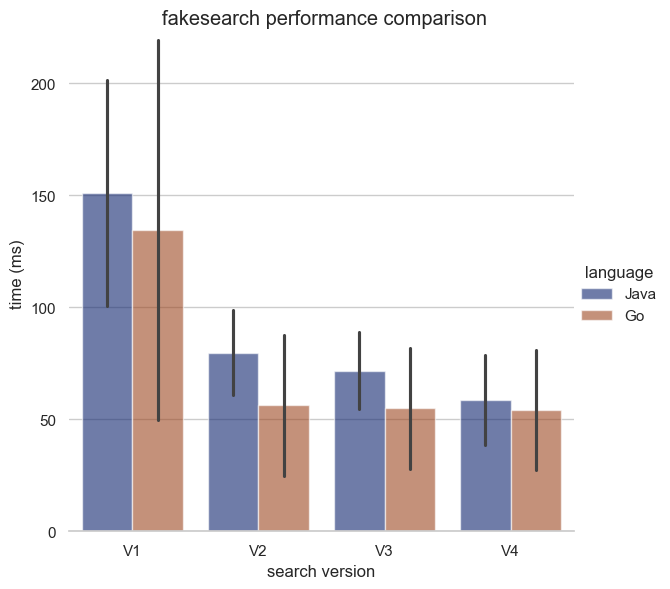

# Concurrency - Go vs Java   

> A doodly[^1] experiment following a surge of inspiration from [Rob Pike's iconic 2012 talk](https://go.dev/talks/2012/concurrency.slide#1) on Golang's concurrency features.    

Go has very elegant concurrency primitives and I wondered what it would be like to express the same example given in the talk in another language lacking coroutines and channels. In the spirit of being contemporarily fair, chose not to use newer (JEP [425](https://openjdk.org/jeps/425), JEP [428](https://openjdk.org/jeps/428)) features.    

## Overview

Query and present web, image and video results form a mock web-search api; observe latencies.  

V1: invoke web, image and video searches sequentially, wait for all.  
V2: invoke web, image and video searches concurrently, wait for all.  
V3: invoke web, image and video searches concurrently, and time-out for the slow ones.  
V4: invoke web, image and video searches concurrently to each of their replicas, use first response from each type.  

---

[^1]: [Doodling](https://en.wikipedia.org/wiki/Doodle) :clown_face: 

